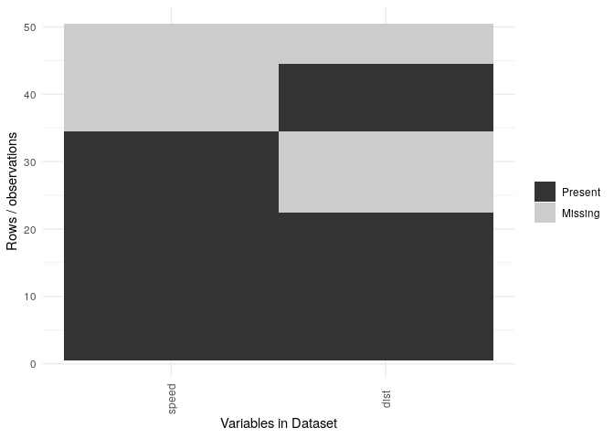
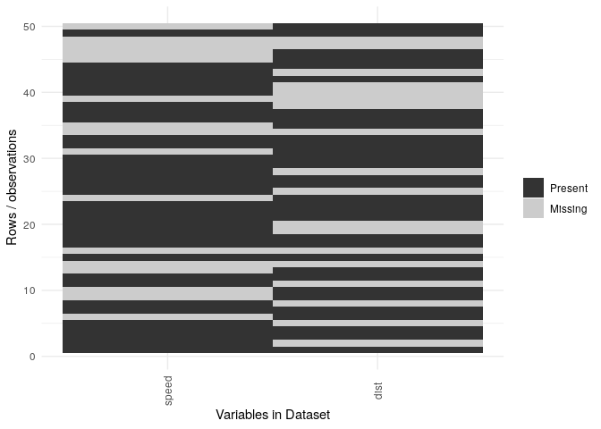
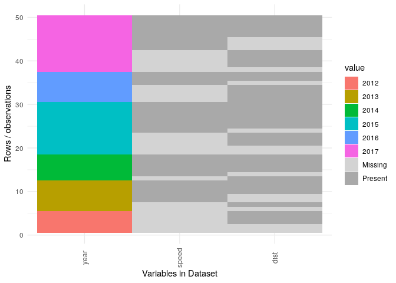
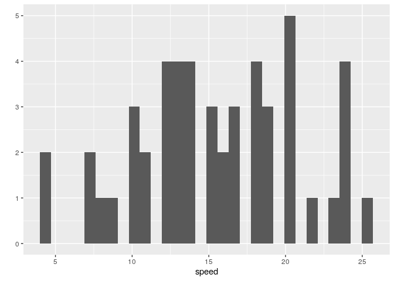
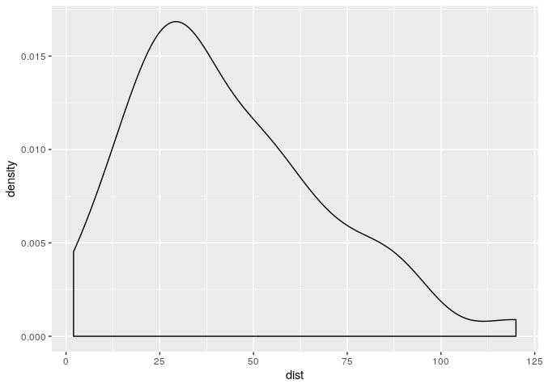

# StudyDataTools

`R package`

## Installation

``` r
devtools::install_github("DanielBonnery/package")
```

## Examples

``` r
example(ggplot_missing,package = "StudyDataTools",ask=FALSE)
```

    ## Loading required package: ggplot2

    ## 
    ## ggplt_> library(reshape2)
    ## 
    ## ggplt_> library(ggplot2)
    ## 
    ## ggplt_> library(plyr)
    ## 
    ## ggplt_> library(magrittr)
    ## 
    ## ggplt_> X=cars
    ## 
    ## ggplt_> for(i in 1:40){
    ## ggplt_+   X[sample(1:50,1,replace=TRUE),sample(1:2,1,replace=TRUE)]<-NA}
    ## 
    ## ggplt_> ggplot_missing(X,reordonne=TRUE)

<!-- -->

    ## 
    ## ggplt_> ggplot_missing(X,reordonne=FALSE)

<!-- -->

``` r
example(ggplot_missing2,package = "StudyDataTools",ask=FALSE)
```

    ## 
    ## ggpl_2> library(reshape2)
    ## 
    ## ggpl_2> library(ggplot2)
    ## 
    ## ggpl_2> library(plyr)
    ## 
    ## ggpl_2> X=cars
    ## 
    ## ggpl_2> reordonne=TRUE
    ## 
    ## ggpl_2> keep="year"
    ## 
    ## ggpl_2> X$year=sample(2012:2017,nrow(cars),replace=TRUE)
    ## 
    ## ggpl_2> for(i in 1:40){
    ## ggpl_2+  X[sample(1:50,1,replace=TRUE),sample(1:2,1,replace=TRUE)]<-NA}
    ## 
    ## ggpl_2> ggplot_missing2(X,keep="year")

<!-- -->

``` r
example(var.summary,package = "StudyDataTools",ask=FALSE)
```

    ## 
    ## vr.smm> data(cars)
    ## 
    ## vr.smm> var.summary(cars)
    ## [[1]]
    ## [[1]]$nlevels
    ## [1] 19
    ## 
    ## [[1]]$is.code
    ## [1] FALSE
    ## 
    ## [[1]]$levels
    ##  [1]  4  7  8  9 10 11 12 13 14 15 16 17 18 19 20 22 23 24 25
    ## 
    ## [[1]]$counts
    ## 
    ##  4  7  8  9 10 11 12 13 14 15 16 17 18 19 20 22 23 24 25 
    ##  2  2  1  1  3  2  4  4  4  3  2  3  4  3  5  1  1  4  1 
    ## 
    ## [[1]]$densityplot
    ## NULL
    ## 
    ## [[1]]$hist

    ## `stat_bin()` using `bins = 30`. Pick better value with `binwidth`.

<!-- -->

    ## 
    ## [[1]]$summary
    ##      speed     
    ##  Min.   : 4.0  
    ##  1st Qu.:12.0  
    ##  Median :15.0  
    ##  Mean   :15.4  
    ##  3rd Qu.:19.0  
    ##  Max.   :25.0  
    ## 
    ## 
    ## [[2]]
    ## [[2]]$nlevels
    ## [1] 35
    ## 
    ## [[2]]$is.code
    ## [1] FALSE
    ## 
    ## [[2]]$levels
    ##  [1]   2   4  10  14  16  17  18  20  22  24  26  28  32  34  36  40  42  46  48
    ## [20]  50  52  54  56  60  64  66  68  70  76  80  84  85  92  93 120
    ## 
    ## [[2]]$counts
    ## 
    ##   2   4  10  14  16  17  18  20  22  24  26  28  32  34  36  40  42  46  48  50 
    ##   1   1   2   1   1   1   1   2   1   1   4   2   3   3   2   2   1   2   1   1 
    ##  52  54  56  60  64  66  68  70  76  80  84  85  92  93 120 
    ##   1   2   2   1   1   1   1   1   1   1   1   1   1   1   1 
    ## 
    ## [[2]]$densityplot

<!-- -->

    ## 
    ## [[2]]$hist
    ## NULL
    ## 
    ## [[2]]$summary
    ##       dist       
    ##  Min.   :  2.00  
    ##  1st Qu.: 26.00  
    ##  Median : 36.00  
    ##  Mean   : 42.98  
    ##  3rd Qu.: 56.00  
    ##  Max.   :120.00

``` r
example(missing.summary,package = "StudyDataTools",ask=FALSE)
```

    ## 
    ## mssng.> X=cars
    ## 
    ## mssng.> for(i in 1:40){
    ## mssng.+   X[sample(1:50,1,replace=TRUE),sample(1:2,1,replace=TRUE)]<-NA}
    ## 
    ## mssng.> missing.summary(X)
    ##   COLUMN_NAME percentage.missing count.missing
    ## 2        dist               0.34            17
    ## 1       speed               0.36            18
